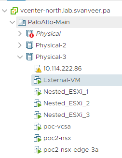
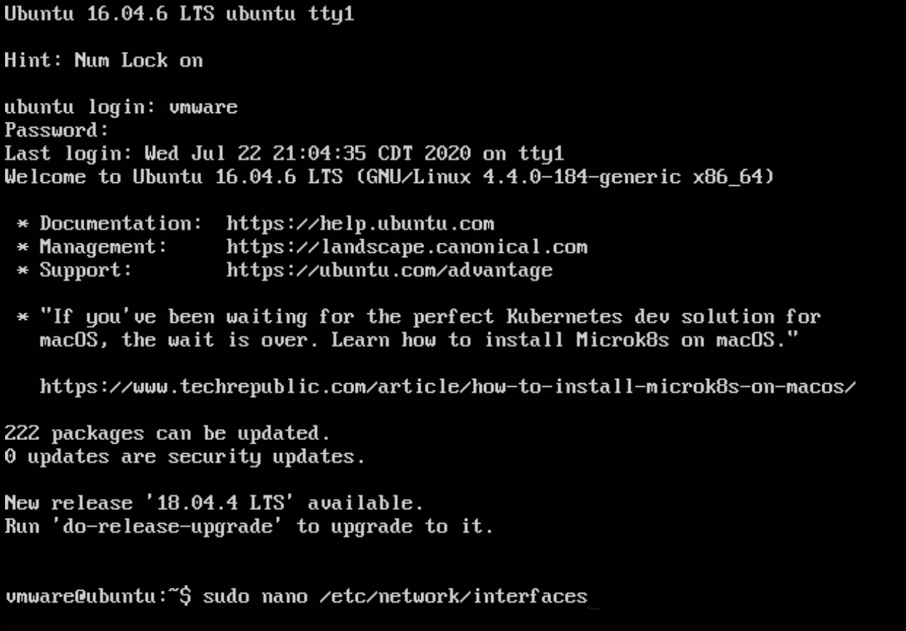

## 4. Verify Lab Deployment
**Estimated Time to Complete: 30 minutes**

Once the Deployment Script has completed the installation and setup process. Your lab environment is fully ready to start testing the NSX Distributed IDS/IPS. Verify vCenter and NSX has been configured as intended.

**Physical Infrastructure Host/vCenter**

Login to the physial environment vcenter and Verify 6 VMs have been deployed, are up and running and are connected to the appropriate port-group: 
* 3 nested ESXI
* 1 NSX Manager
* 1 NSX Edge 
* 1 vCenter
* 1 External VM

Confirm you are able to ping each nested ESXi, the Lab NSX Manager and the Lab vCenter.

**External VM**

You will need to manually change the IP address of the external VM to an IP address in the same managment subnet you used for vCenter/NSX Manager and the rest of the environment. You will also need to adjust the static route so the external VM is able to reach the DMZ subnet inside the nested lab environemnt.
From the physical environent vCenter, open a console to **External VM** and take the following steps:
    * Login with **vmware**/**VMware1!**
    * Type **sudo nano /etc/network/interfaces** to open the network configuration file

    * On the line that says 
    
    **use auxiliary/scanner/portscan/tcp** to select the portscan module
    * Type **set THREADS 50** 
    * Type **set RHOSTS 192.168.10.0/24** to define the subnets to scan. These should match the **DMZ** Subnet
    * Type **set PORTS 8080,5984** to define the ports to scan (Drupal and CouchDB servers)
    * Type **run**

**Lab vCenter**
Login to lab vCenter and verify the cluster of 3 nested ESXi appliances is functional and 4 vulnerable VMs have been deployed on the cluster:
* APP-1-WEB-TIER connected to **DMZSegment** Portgroup
* APP-2-WEB-TIER connected to **DMZSegment** Portgroup
* APP-1-APP-TIER connected to **InternalSegment** Portgroup
* APP-2-APP-TIER connected to **InternalSegment** Portgroup

**Lab NSX Manager**
1.	In the NSX Manager UI, navigate to Inventory -->  Virtual Machines
2. Click **View Details**
2. Note the IP addresses for the 4 VMs that were deployed

[TO BE COMPLETED]
---

[***Next Step: 5. Initial IDS/IPS Configuration***](/docs/5-InitialConfiguration.md)
