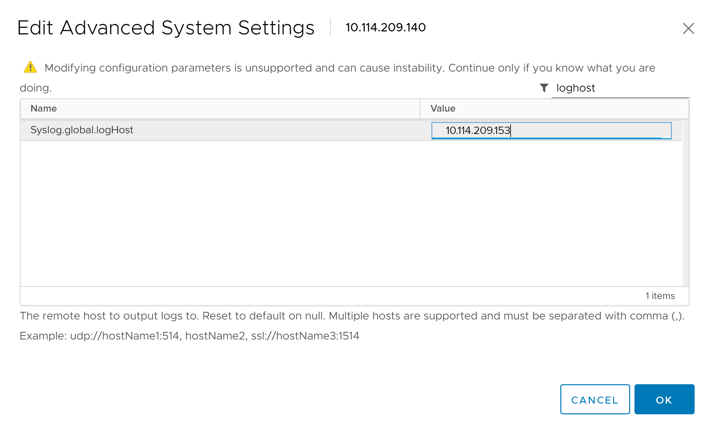
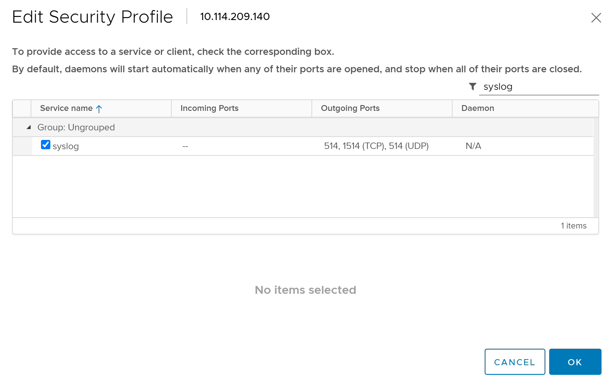
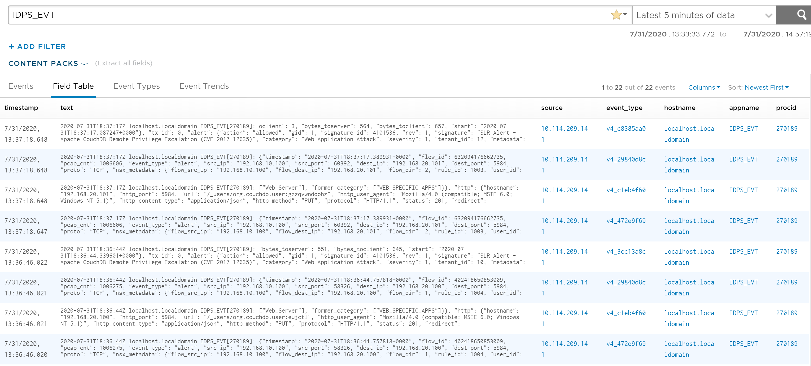

## 8. Advanced Configuration
**Estimated Time to Complete: 30 minutes**

In this **optional** exercise, we will explore some more advanced options in the NSX Distributed IDS/IPS Configuration

**Enable IDS/IPS event logging directly from each host to a syslog collector/SIEM**

> **Note**: In addition to sending IDS/IPS Events from each distributed IDS/IPS engine, you can send them directly to a Syslog collector or SIEM from each host. Events are sent in the EVE.JSON format for which many SIEMS have pre-existing parsers/dashboards. 

In this exercise, you will learn how to conigure IDS event export from each host to your syslog collector or SIEM of choice. I will use **vRealize Log Insight**. You can use the same or your own SIEM of choice.
We will not cover how to install **vRealize Log Insight** or any other logging platform, but the following steps will cover how to send IDS/IPS evens to an aleady configured collector.

1. Login to lab vCenter and click on **Hosts and Clusters**, then select one of the 3 hosts that were deployed.
2. Click the **Configure** Tab and Scroll down to **System**. Click **Advanced System Settings**
3. Click the **Edit** button
4. In the **Filter** field, type **loghost**
5. Enter the **IP address of your syslog server** in the **Syslog.global.logHost** value field and click **OK** to confirm.

6. Repeat the same for the remaining 2 hosts.
7. Click on **Firewall** in the same **System** menu
8. Click the **Edit** button
9. In the **Filter** field, type **syslog**
10. Tick the checkbox next to **syslog** to allow outbuound syslog from the host.
11. Repeat the same for the remaining 2 hosts.

12. Open a terminal session to one of the lab hypervisors , login with **root**/**VMware1!** and execute the below commands to enable IDS log export via syslog
    * Type **nsxcli** to enter the NSX CLI on the host
    * Type **set ids engine syslogstatus enable** to enable syslog event export
    * Confirm syslog event export was succesfully enabled by running the command **get ids engine syslogstatus**

```console
[root@localhost:~] nsxcli
localhost> set ids engine syslogstatus enable
    result: success
    
localhost> get ids engine syslogstatus
       NSX IDS Engine Syslog Status Setting
--------------------------------------------------
                       true
```
13. Login to your syslog collector/SIEM and confirm you are receiving logs form each host.
14. Configure a parser or a filter to only look at IDS events. You can for example filter on the string **IDPS_EVT**. 

15. Now we will run the lateral attack scenario we used in an earlier exercise again. This time, use the pre-defined script to run the attack instead of manaully cofiguring the **Metasploit modules**.
16. Before you execute the script, if you have not previously used it, you need to ensure the IP addresses match your environment.  Utype **sudo nano attack2.rc** and replace the **RHOST** and **LHOST** IP addresses accordingly to match with the IP addresses in your environment. 
    * **RHOST** on line 3 should be the IP address of the App1-WEB-TIER VM 
    * **SUBNET** on line 6 (route add) should be the Internal Network subnet 
    * **LHOST** on line 9 should be the IP address of the External VM (this local machine) 
    * **RHOST** on line 10 should be the IP address of the App1-APP-TIER VM RHOST on line 13 should be the IP address of the App2-APP-TIER VM
17. After saving your changes, run the attack2 script by executing **sudo ./attack2.sh**.
18. Confirm a total of 3 meterpreter/command shell sessions have been established
19. Confirm your syslog server/SIEM has received the IDS events, directly from the host


This completes this exercise.

---

[***Next Step: 9. Segmentation***](/docs/9-Segmentation.md)
